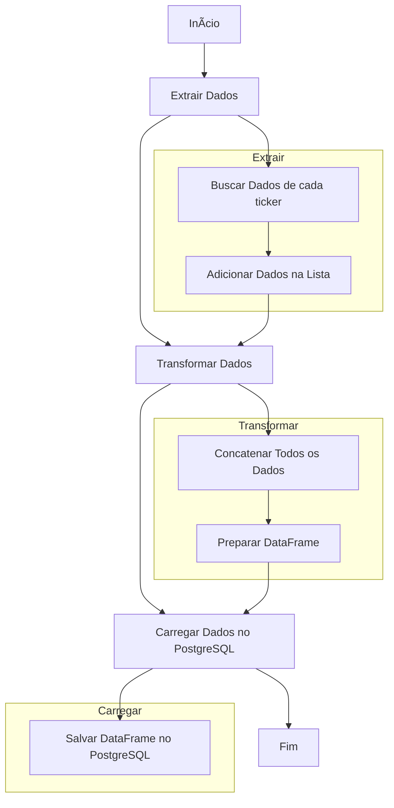

# Projeto DBT-Core Data Warehouse Tickers Setor de Energia

```mermaid
graph TD;
    A[Início] --> B[Extrair Dados]
    B --> C[Transformar Dados]
    C --> D[Carregar Dados no PostgreSQL]
    D --> E[Fim]

    subgraph Extrair
        B1[Buscar Dados de cada ticker]
        B2[Adicionar Dados na Lista]
    end

    subgraph Transformar
        C1[Concatenar Todos os Dados]
        C2[Preparar DataFrame]
    end

    subgraph Carregar
        D1[Salvar DataFrame no PostgreSQL]
    end

    B --> B1
    B1 --> B2
    B2 --> C
    C --> C1
    C1 --> C2
    C2 --> D
    D --> D1

```